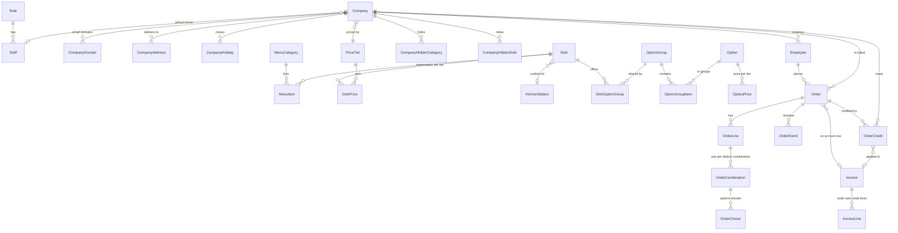

# Fernleaf Kitchen: operations admin panel

An internal admin panel for a corporate boxed-lunch kitchen in Ahmedabad (a fictional company, "Fernleaf Kitchen"). Companies sign up, their employees order individual boxed meals for specific delivery dates, and the kitchen cooks, packs and delivers them. Employees never pay: every order is billed to their company. Staff create orders on behalf of employees, so every workflow can be exercised from the panel.

**Stack:** Next.js 16 (frontend) · NestJS 12 (API) · Prisma 6 on PostgreSQL. The frontend talks to the API over HTTP only; there are no server actions and no business logic in Next.js.

| | Live | Branch |
|---|---|---|
| Prod | https://kitchenops-xi.vercel.app (API on Render: `kitchenops-api-prod`) | `main` |
| Dev | Vercel preview of `dev` (API on Render: `kitchenops-api-dev`) | `dev` |

Sign-in accounts (password `Test@1234` for all):

| Role | Email | Lands on |
|---|---|---|
| Admin | admin@test.com | operations overview |
| Kitchen | kitchen@test.com | kitchen today |
| Dispatch | dispatch@test.com | dispatch today |
| Driver | driver@test.com | my day (phone friendly) |

The demo data is generated relative to "today" and refreshed daily (see [Demo data](#demo-data)). The kitchen works Monday to Saturday, so on a Sunday or holiday there are no orders for "today" and the dashboards show the next working day.

---

## Contents
1. [Running it locally](#running-it-locally)
2. [Architecture](#architecture)
3. [Data model](#data-model)
4. [Key decisions and trade-offs](#key-decisions-and-trade-offs)
5. [Dashboards (4.11)](#dashboards-411)
6. [What was built, skipped, and what next](#what-was-built-skipped-and-what-next)
7. [Ambiguities and how they were interpreted](#ambiguities-and-how-they-were-interpreted)
8. [Deployment](#deployment)

---

## Running it locally

Requirements: Node 22, Docker (for Postgres).

```bash
# 1. Postgres on localhost:5433
docker compose up -d

# 2. Backend (http://localhost:3001)
cd backend
cp .env.example .env            # defaults work for local development
npm ci
npx prisma migrate deploy
npm run db:seed                 # reference data, accounts, companies, menu, prices, demo orders (safe to re-run)
npm run start:dev

# 3. Frontend (http://localhost:3000) in another terminal
cd frontend
cp .env.example .env.local      # BACKEND_URL=http://localhost:3001
npm ci
npm run dev
```

Checks (all clean): `npm run lint`, `npm run typecheck`, `npm test` (unit, 82 tests) and `npm run test:e2e` (against the seeded local database, 76 tests; it creates throwaway rows, so only point it at a disposable database) in `backend/`; `npx tsc --noEmit` and `npx eslint app` in `frontend/`.

Optional environment variables for the API: `CLOUDINARY_URL` (`cloudinary://<key>:<secret>@<cloud>`) enables image uploads (dish photos and delivery photos; the browser uploads straight to Cloudinary with a short-lived signature from the API), and `DEMO_REFRESH_TOKEN` enables the daily demo refresh endpoint.

---

## Architecture

```
Browser ──► Next.js (Vercel)  ──/api/* rewrite──►  NestJS API (Render)  ──Prisma──►  PostgreSQL (Render)
 (client components only)       same-origin cookie        modules below
```

* **Same-origin API.** Next rewrites `/api/*` to the API, so the session cookie (httpOnly, SameSite=Lax, 8 h) is first-party and there is no CORS surface. Passwords are hashed, sign-in is rate limited, and every input is validated on the server with a global `ValidationPipe` (whitelist, forbid unknown fields).
* **Capabilities, not role names.** A role is a database row holding a list of capabilities (`orders:manage`, `kitchen-board:update`, `billing:manage`...). The server only ever checks capabilities (`@Authorize(...)`), the frontend only shows navigation for capabilities, and capabilities are re-read on every request, so changing a role takes effect immediately. A new role is a new row, not a code change.
* **Backend modules** (`backend/src`): `auth`, `settings` (calendar, cut-off), `reference-data`, `staff`, `companies`, `employees`, `catalogue` (dishes, option groups, images), `pricing` (tiers), `menu` (categories, hiding, employee menu), `orders` (rules, cut-off processing), `kitchen`, `dispatch` (and the driver view), `billing`, `dashboard`, `demo`.
* **Pure engines with unit tests.** The rules most likely to break are plain functions with no database: `kitchen-calendar` (cut-off and working days), `company-calendar`, `pricing-engine`, `menu-engine`, `order-rules` (combinations and totals), `kitchen-plan` (planned times and lateness), `dispatch-rules` (drops, gating, on-time) and `invoice-rules` (credits and invoice maths). Services load data, call them, and write.
* **Money is integer cents** everywhere. Derived prices round up to the next 5 cents using `BigInt`. An order total equals the sum of its lines, and an invoice total equals the sum of its lines (both are checked in tests, and the invoice page shows the check).
* **Time zone: `Asia/Kolkata`.** The kitchen is in Ahmedabad. Cut-offs, delivery dates and "today" are computed in the kitchen zone with Luxon, independent of the server's or the browser's zone; the frontend always formats in the kitchen zone. Dates are ISO `YYYY-MM-DD` strings in the API.
* **Concurrency.** Orders carry a `version`: a write must send the version it read, otherwise it is refused ("someone else changed this order"). Kitchen units and dispatch drops are advanced inside a transaction that locks the affected order rows (`SELECT ... FOR UPDATE`), so two people clicking at once cannot both win or skip a derived step (for example the order becoming kitchen-ready). Creating an invoice locks its orders the same way. These races are covered by e2e tests.
* **Migrations** are plain SQL in `backend/prisma/migrations`; the API runs `prisma migrate deploy` on start.

---

## Data model



Reading guide:

* **Settings:** `KitchenSettings` is a singleton (working days, cut-off time and day count, kitchen-ready buffer, default dispatch lead, on-time grace). `KitchenHoliday` is the kitchen calendar. Reference lists (allergens, dietary tags, stations, portion sizes, packaging) are admin-managed and deactivated rather than deleted because dishes reference them.
* **Catalogue:** a `Dish` has a SKU, cost, station, minimum order quantity, allergens and tags. Option groups are reusable and shared between dishes; each group says whether it is required, its min and max selections, and whether it uses portion sizes. Prices live per price tier (`DishPrice`, `OptionPrice`, plus size surcharges); a tier can be derived from another (a markup, rounded up to the next 5 cents).
* **Order lines and combinations (4.1):** an order has lines (a dish and a quantity); a line is split into combinations (a quantity and a set of choices), and identical combinations are merged by a normalised `signature`. A combination is the kitchen's prep unit, and carries its own start and done stamps.
* **Orders snapshot** names, prices and the company at the time, so catalogue edits and employee moves never rewrite history. The order's progress is a set of timestamps (`placedAt`, `confirmedAt`, `kitchenStartedAt`, `kitchenReadyAt`, `dispatchReadyAt`, `outForDeliveryAt`, `deliveredAt`) plus an `OrderEvent` timeline with the actor.
* **Billing:** `Invoice` (internal record) → `InvoiceLine` (order lines and negative credit lines). `Order.invoiceId` is a single column, so an order is on at most one invoice by construction. `OrderCredit` records money owed back and where it was applied.

---

## Key decisions and trade-offs

The complete running log is in [`docs/DECISIONS.md`](docs/DECISIONS.md). The ones that shaped the design:

* **Capability-based access over role checks.** A little more setup than `if (role === 'ADMIN')`, but roles become data and no code knows role names. Each account has only its role's access.
* **Derived, not stored, where it can be.** Drops (company + address + exact time) and the planned kitchen/dispatch times are computed from the orders, so an overridden delivery time or address moves things automatically and nothing can drift. The trade-off is a query per board view; at the stated scale (400 orders) the board loads in one query and stays well under a second.
* **Cut-off processing runs inside the API** every minute, catches up on start-up and also lazily when orders are read, and it is idempotent. A free Render instance that sleeps still processes the cut-off correctly the next time it wakes. A queue or an external cron would be the next step at scale.
* **Rate limiting is per account for sign-in and per IP otherwise.** Everyone reaches the API through the frontend's proxy, so a per-IP limit would punish a whole office; see the decisions log.
* **Prices lock when an order is placed.** Drafts show today's prices and are re-priced on placing; afterwards unchanged items keep their placed price.
* **Pre-tax, no delivery fee, one order type** (out of scope per the brief).
* **Credits instead of editing invoices.** Issued invoice lines are never edited. A cancellation, rejection or short delivery after invoicing adds a credit; a paid invoice is untouched and the credit is carried forward. See [billing](docs/DECISIONS.md#billing-phase-9).
* **Client components with a thin data hook** rather than a heavy data layer: the app is an internal tool whose pages are mostly live tables, and this keeps the data flow easy to follow.

---

## Dashboards (4.11)

Each role lands on its own dashboard, chosen by capability (orders → kitchen → dispatch → driver, first match). All figures use integer cents and kitchen-zone dates. **"Working day"** is today when the kitchen works today, otherwise the next kitchen working day; the page says which. Kitchen and dispatch figures come from the same code as the Kitchen and Dispatch boards, so a dashboard can never disagree with the board behind it (this is tested).

**Orders that count.** *Billable* = orders in status confirmed or delivered. *Cancelled* and *rejected* orders are counted in their own columns but never in a billable amount. Draft and placed orders are not billable until their cut-off confirms them. Missing data is shown as "—", never as zero or 100%.

### Admin (operations overview)

Why: the admin runs the whole operation and needs to see what is going wrong now, what is coming, how the last week went, and what money is outstanding.

| Figure | How it is calculated |
|---|---|
| Late in the kitchen | Confirmed orders on the working day whose planned kitchen-ready time has passed and which are not kitchen-ready. Planned kitchen-ready = delivery time − company delivery minutes − kitchen buffer (settings, 30 min). |
| At risk in the kitchen | The same orders, within 30 minutes before that planned time and not ready. |
| Drops without a driver | Drops (confirmed orders of one company, address and delivery time) on the working day that are not delivered and have neither an assigned driver nor a company default driver. |
| Late drops | Drops not yet dispatched after their planned dispatch-ready time (delivery time − company delivery minutes), plus drops with any delivery marked late. |
| The working day | Confirmed + delivered orders on the working day; how many are kitchen-ready (kitchen-ready time recorded); number of drops; drops fully delivered. |
| Coming up | For the working day and the next 5 working days, orders grouped by **delivery date** and status, with that date's cut-off (kitchen calendar) and whether it has passed. |
| Last 7 working days (table) | The 7 kitchen working days before today, grouped by **delivery date**: delivered, confirmed-not-delivered, cancelled, rejected, and the billable amount (sum of totals of confirmed + delivered orders). |
| Delivered on time | Delivered orders in those 7 days with a recorded on-time result: on time ÷ (on time + late). On time = delivered within the grace (setting, 5 min) of the delivery time. Delivered orders with no recorded timing are excluded, and if there are none the figure is "—". |
| Average lateness when late | Mean late minutes of the late deliveries in those 7 days (minutes past the delivery time). |
| Money (needs billing access) | *Not yet invoiced*: confirmed + delivered orders not on an invoice, net of credits already taken off them. *Invoiced, unpaid*: total of unpaid invoices (void invoices excluded). *Credits owed back*: open credits waiting for the next invoice. |

Not shown: revenue charts or trends, per-company profitability or cost margins (dish costs are entered but nothing here claims a margin), and employee-level activity. A trend line over a week of seeded data would look better than it is.

### Kitchen lead (kitchen today)

Why: at 6 am the lead needs to know how much there is to cook, where, and which orders will be late if nothing changes.

| Figure | How it is calculated |
|---|---|
| Confirmed orders | Confirmed orders for the working day (delivered ones are not on the kitchen board). |
| Prep units still to do | Prep units (one per distinct combination on an order line) not yet done: *not started* + *cooking*. The detail line also gives how many are done of the total. Counted across the whole day, not just the visible page. |
| First kitchen-ready deadline | The earliest planned kitchen-ready time among orders that are not kitchen-ready. "—" when everything is ready. |
| Late / at risk | As above, for the working day. |
| Orders with allergy sign-off | Confirmed orders on the working day where staff acknowledged an allergy conflict when ordering. A prompt to double check packing, not a list of every allergic employee. |
| What to cook | Per dish and choice combination: portions still to do (units not done × quantity) and the total ordered, biggest remaining first, top 12. |
| By station | Units to do, cooking and done per kitchen station; dishes without a station are under "Unassigned". |
| Most urgent orders | Up to 5 unfinished orders, late first, then at risk, then by planned kitchen-ready time. |
| Next working day | Draft, placed and already-confirmed order counts for the next working day. Placed orders are only confirmed at that day's cut-off, so this is a forecast and labelled as one. |

Not shown: ingredient or purchasing quantities (there is no recipe data), staff productivity per cook, and delivered or cancelled orders.

### Dispatcher (dispatch today)

Why: the dispatcher moves cooked orders out of the door on time, so they need what leaves next, what has no driver, and where everything is.

| Figure | How it is calculated |
|---|---|
| Drops today / orders | Number of drops (and orders in them) among confirmed + delivered orders on the working day. |
| Out for delivery / Delivered | Drops by their least advanced order: a drop counts as delivered only when all its orders are delivered. |
| No driver yet | Undelivered drops with no explicit or default driver. |
| Late | As the admin's late drops. |
| Next to leave | Up to 6 undispatched drops by planned dispatch-ready time, with the driver, status, and why a drop is held (for example "waiting for 1 order still due from the kitchen"). |
| Where every drop is | Drop counts by stage: cooking, kitchen ready, dispatch ready, out for delivery, delivered. |
| Driver load | Drops and delivered drops per driver for the working day; drops with no driver are grouped as "No driver". |

Not shown: customer contact details, distance or route optimisation (no mapping is built), and past days' performance (that is on the admin's dashboard).

### Driver (my day)

Why: a driver on a phone only needs their next stop and whether they are keeping up.

| Figure | How it is calculated |
|---|---|
| My drops today / Delivered / Out / Waiting | Drops where the driver is the assigned (or company default) driver, for today in the kitchen zone. *Delivered* = all orders delivered; *Out* = out for delivery; *Waiting* = everything else not yet out. |
| Next drop | The earliest-time drop that is not delivered: time, company, address, standing driver instructions, box count and whether it can be marked delivered now. |
| My on-time record | The driver's own deliveries (orders they marked delivered) over the last 7 kitchen working days before today: on time ÷ (on time + late), with the same grace as above. "—" when there are no timed deliveries. |

Not shown: other drivers' drops or figures, order prices and employee details beyond what the delivery needs.

---

## What was built, skipped, and what next

**Built (all [Must] items):** authentication and capability-based roles; kitchen settings with working days, holidays and the cut-off rule; reference data; companies (domains, addresses, holidays, delivery defaults, default driver, price tier, menu hiding) and employees (including moving between companies and bulk import from CSV with row-level error reports); catalogue (dishes, shared option groups, portion sizes, uploads); price tiers with derived pricing and a tier grid; menu categories, secret categories found only by search, per-company hiding and an employee menu preview; orders with combinations, allergy acknowledgement, cut-off processing, overrides and a timeline; the kitchen board; the dispatch board and a phone-friendly driver view with on-time tracking; company billing with invoices, credits and void; settings; four role dashboards; seeded Ahmedabad demo data that refreshes daily.

**Skipped, and why:** everything listed as out of scope in the brief (payments, exports, tax, delivery fees, notifications, audit logs and so on). Beyond that:
* **No automated UI tests.** The brief asks for business-rule tests, so effort went to unit tests of the pure engines and e2e tests of the API (races included); UI was checked by hand in a browser.
* **No real-time updates.** Boards poll every 30 seconds instead of using websockets; correctness comes from server-side checks, not from a fresh screen.
* **Drop splitting is automatic, not manual.** Late orders follow later in the same drop; staff cannot re-group orders into different drops by hand.
* **Employee moves do not retroactively re-bill:** orders keep the company they were placed under.

**With more time:**
* A job queue (or external scheduler) for cut-off processing and the demo refresh, instead of the in-process timer.
* Real-time board updates, and a mobile-first pass over the kitchen board.
* Invoice PDFs and statements per company, and aging of unpaid invoices.
* A per-day capacity limit per station, and route grouping for drivers.
* Component-level UI tests for the order builder and boards.

---

## Ambiguities and how they were interpreted

Each of these was a judgment call; the reasoning is in [`docs/DECISIONS.md`](docs/DECISIONS.md).

* **"Secret" categories** are hidden from browsing but found by search.
* **One order per employee per delivery date** (cancelled and rejected orders do not count).
* **Cut-off** is a time on a working day a configurable number of working days before delivery, computed from the kitchen calendar only; company calendars do not move it. Orders after cut-off can be changed only by an admin.
* **Beyond cut-off, an order is billed to the company** even if the employee later leaves it: a transfer cancels the employee's open orders only if they are still before cut-off.
* **Rejected** means the kitchen cannot fulfil the order (reason required); it is never billable. **Cancelled** means withdrawn, or a draft left open at cut-off.
* **Allergies** warn and require an explicit acknowledgement; they never block an order.
* **Prep unit** is one per combination (a combination with quantity 12 is a single start and finish).
* **Late and at risk** (kitchen): late once the planned kitchen-ready time passes; at risk in the last 30 minutes before it.
* **A drop that is only partly ready:** ready orders leave together; an order still cooking is waited for only while it can still make its time. A late one does not hold the rest back and follows as a second trip.
* **On time** is within a configurable grace (default 5 minutes) of the delivery time; the exact late minutes are always recorded.
* **Invoiced orders that later change:** credits, never edits; paid invoices are final; unpaid invoices can be voided. See billing in the decisions log.
* **"Today" on a day the kitchen is closed:** there are no orders and no drops that day; dashboards show the next working day and say so.

---

## Deployment

Two environments from one repo, kept separate (separate databases schemas, API services and frontends):

| | Branch | API (Render) | Frontend (Vercel) | Schema |
|---|---|---|---|---|
| Prod | `main` | `kitchenops-api-prod` | production project | `public` |
| Dev | `dev` | `kitchenops-api-dev` | preview of `dev` | `dev` |

`render.yaml` describes both API services. Secrets (`DATABASE_URL`, `FRONTEND_ORIGIN`, `CLOUDINARY_URL`, `DEMO_REFRESH_TOKEN`) are set in the Render dashboard and never committed. The frontend needs one variable, `BACKEND_URL`, pointing at its API. The API is a free Render instance that sleeps after inactivity: an uptime pinger on `/api/health` keeps it awake (`.github/workflows/keep-alive.yml` is a backup), and `/api/health` also checks the database.

### Demo data

`npm run db:seed` is idempotent and safe on any environment: it restores the four review accounts and role capabilities, fills reference data, researched Ahmedabad companies and employees, a pure-vegetarian menu with stock photos, price tiers and category visibility, then generates realistic orders for the past 7 and next 6 working days with every status on every day, with kitchen, dispatch, delivery and billing history. It only fills dates and records that are missing, and it never touches orders staff created.

With `DEMO_AUTO_REFRESH=true` (set on both Render services) the API also refreshes the demo data itself: 15 seconds after it starts (so when it wakes for a reviewer) and every 30 minutes while awake. Today's kitchen and dispatch progress follows the clock, so the boards look realistic at any hour. The daily job (`.github/workflows/demo-refresh.yml`, 01:00 IST) calls `POST /api/demo/refresh` with the `x-demo-token` header on each environment. It completes past days' work, generates orders around the new "today" (including a drop for `driver@test.com`), and invoices finished weeks. It is idempotent, and the route does not exist unless `DEMO_REFRESH_TOKEN` is set. Repository secrets needed: `DEMO_REFRESH_TOKEN`, `PROD_API_URL`, `DEV_API_URL`.
